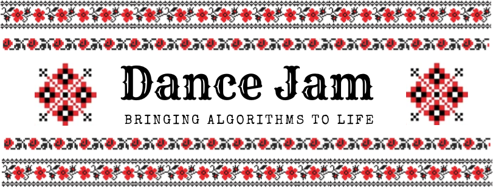
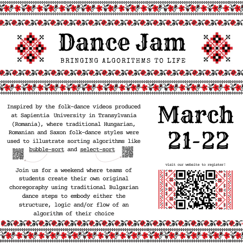

{ width=100% }

# Where Algorithms Meet Artistry

Dancers and coders will team up to create **a choreographed algorithm**.

_“Choreographed what??”_  
You heard us!

Inspired by the folk‑dance videos produced at Sapientia University in Transylvania (Romania), where traditional Hungarian, Romanian and Saxon folk‑dance styles were used to illustrate sorting algorithms like [bubble‑sort](https://www.youtube.com/watch?v=lyZQPjUT5B4) and [select-sort](https://www.youtube.com/watch?v=Ns4TPTC8whw). 

Our jam invites students to create their own original choregoraphy using traditional Bulgarian dance steps to embody either the structure, logic and/or flow of a chosen algorithm.

{width=100%}

## How It Works

### The Weekend Jam: Kickoff & Creation
On the weekend of March 21–22, cross‑disciplinary teams of dancers and programmers come together to select an algorithm and bring it to life through movement.

Each team chooses an algorithm (either their own or from the list under the Algorithms tab) and begins by getting everyone on the same page: 
dancers showcase the foundational movement "blocks" of Bulgarian folk dance, while programmers break down the logic of the chosen algorithm.

Then comes the creative heart of the jam. Working side‑by‑side, dancers and coders collaborate to map algorithmic logic onto physical space. 
Teams will explore how each step of an algorithm might translate into rhythm, pattern, and movement. 
By the end of the weekend, every team will have a draft choreography ready to take into the next stage.

### Refinement & Rehearsal
Over the following two weeks, teams meet asynchronously to refine and debug their choreography. 
Dancers continue developing and polishing the movement; 
for programmers, participation is optional — though those who want to add a technical flair are encouraged to design animations or graphics to accompany the performance.

At the end of this stage, each team submits a final version for consideration in the showcase selection.

### Showcase Event
Selected choreographies will be performed live at a closing showcase event, 
celebrating the creativity and collaboration that brought algorithms to life on the dance floor.

## Why Participate?

The Dance Jam is a chance to break down the walls between disciplines and build something completely unexpected. 
Whether you're a dancer curious about algorithms or a programmer who's never thought about movement, 
this is your opportunity to collaborate, experiment, and create.
[Register](registration.qmd) now to save your spot!

{width=100%}